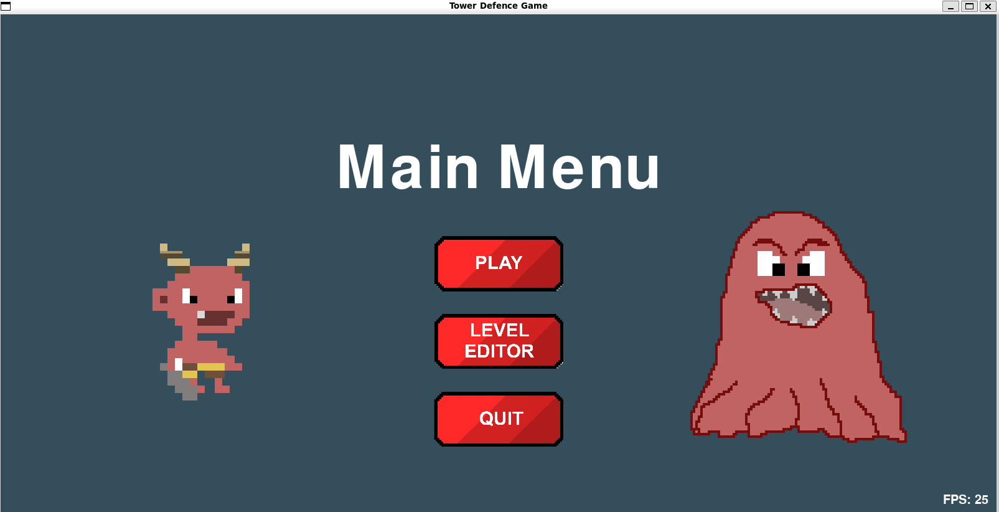
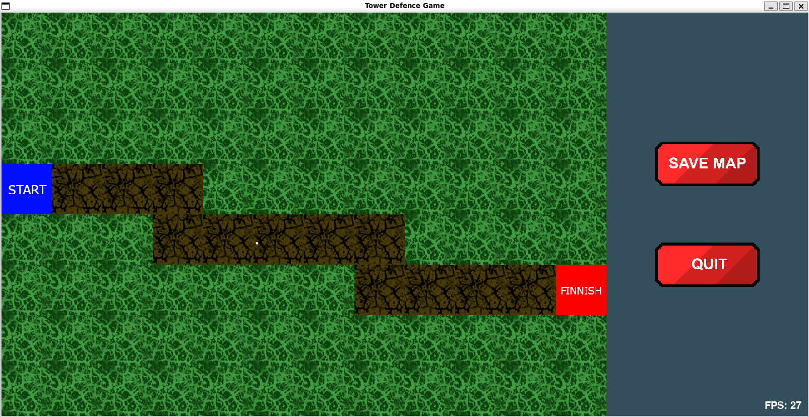
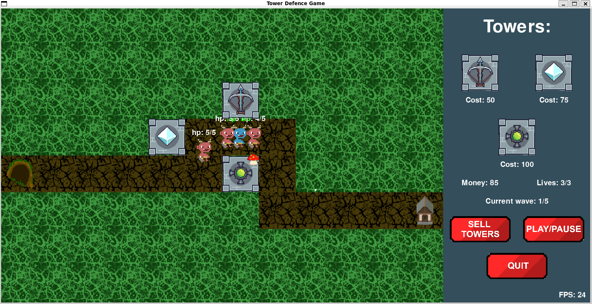
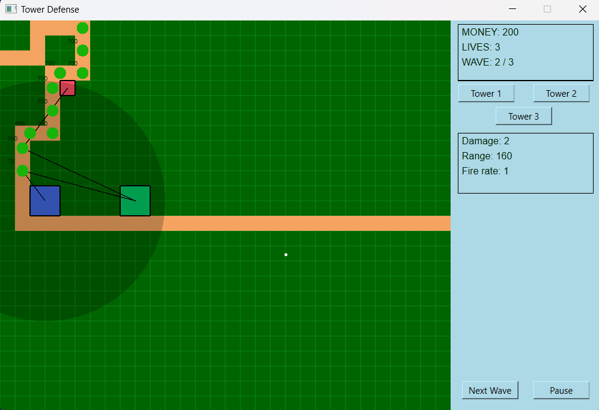

# Tower Defense Game - PyGame and PyQt6

## Introduction
In this repository you will find two different tower defense games, one developed with PyGame and one developed with PyQt6. I developed these two programs as a final project for a Python course at Aalto University. 

## PyGame

The PyGame version includes three main states that the player will encounter while playing: the main menu, the level editor, and the game window. Below is a short description of the three different states.

#### Main Menu
When running the program the player is greeted by the main menu. The main purpose of this state is to help the player navigate between the level editor and the game window. 



#### Level Editor
In the level editor, the player is able to create a custom map to play on. The map is made up of a 12x8 grid of tiles. In the level editor every tile has four modes: road, grass, start, and finnish. To draw a map the player can simply click the different tiles to switch between these four modes. Every map has to start and end at the edge of the grid. Remember to set a start and an end tile before saving the map. If the map is unreadable, a default map will be set.



#### Game Window
The game window consists of a map and a menu containing towers. In the menu, the lives and money of the player is also displayed. Towers can be bought and placed to stop the enemies from reaching the base. More money can be generated by killing enemies and clearing waves. The player starts the game with 3 lives. If an enemy reaches the base, one life is lost. At 0 lives, the game is lost.

There are three different types of towers: basic tower, ice tower, and poison tower. The basic tower shoots a projectile that damages a single enemy. The ice tower shoots a projectile that freezes an enemy for a short period of time without damaging it. The poison tower shoots a projectile that poisons enemies. Poisoned enemies take damage over time (note: freeze and poison effects doesn't stack). Towers can be sold for 50% of their initial price. To win the game, the player has to survive 5 waves of enemies. The different types of enemies are: basic enemy, stealth enemy, and boss enemy. The basic enemy is affected all towers, the stealth enemy is immune to poison, and the boss enemy can't be frozen. When killed, the boss enemy will spawn a basic enemy and a stealth enemy that continues where the boss enemy died. 



## PyQt6
The PyQt6 program is simpler than the PyGame version but it is still a functioning tower defense game. I mainly developed this version for comparison between the libraries. The PyQt6 game only consists of one state. When you run the program you jump right into the game window. Play the game by placing a tower and clicking the "next wave button".



## Running the Programs
Make sure to install PyGame and PyQt6 before running the programs.

```
pip install pygame, pyqt6
```

To run the PyGame version, in the terminal, navigate to the project root directory and execute:
```python3 PyGame_src/main.py``` on Linux, or:
``` python PyGame_src/main.py ``` on Windows.

To run the PyQt6 version, in the terminal, navigate to the project root directory and execute:
```python3 PyQt_src/main.py``` on Linux, or:
```python PyQt_src/main.py``` on Windows.
